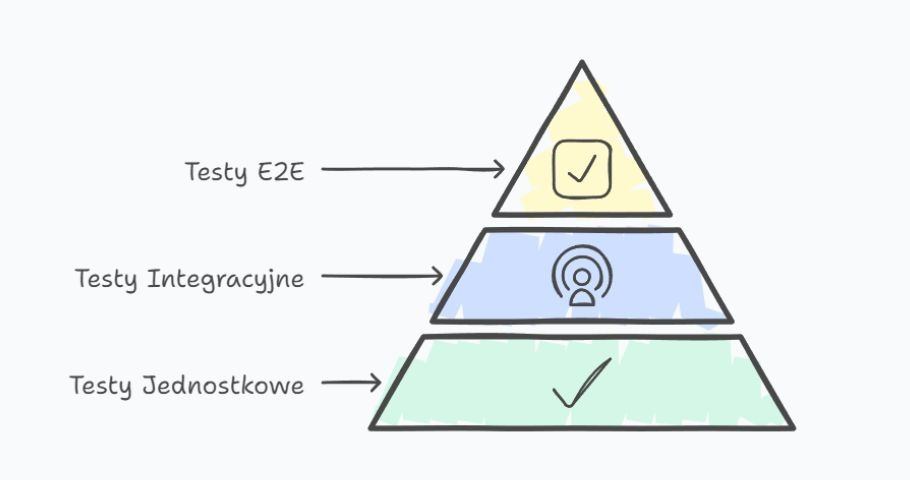

# Jak testować automatycznie?
Autor: Michał Dobrzycki
---
## Piramida testów

--
## Testy jednostkowe
Kiedyś pisanie głównie przez developerów.

Pomaga szybko (w sekundach) znaleźć defekty i błędy regresji wraz ze wskazaniem numeru linijki błędu w kodzie.

Szczęśliwszy cały zespół, bo błąd zostanie wyłapany **przed** deploymentem na środowisko dev/qa.

--
## Testy integracyjne
Dziś pisane wspólnie, a w niektórych firmach nawet tylko przez Testerów.

Wymagają CI/CD i konteneryzacji (lub deploymentu). Błąd wyłapany na tym etapie jest trudniejszy do zlokalizowania dla osoby która go naprawia.

--
## Testy E2E
Symulują użytkownika, pisane głównie przez Testerów, choć (często) bywa że developerzy zmieniający aplikację zmieniają też logikę testów.

Wymagają deploymentu aplikacji, ale w zamian symulują użytkownika końcowego.

--
# F.I.R.S.T
- Fast
- Isolated
- Repeatable
- Self-validating
- Timely

Który poziom testów spełnia wszystkie te zasady?

--
## Które wybrać?
To jak byśmy podzielili procentowo ilość testów w piramidzie (UT/IT/E2E)?
- 30/30/40
- 50/10/40
- 10/10/80
- 70/20/10
